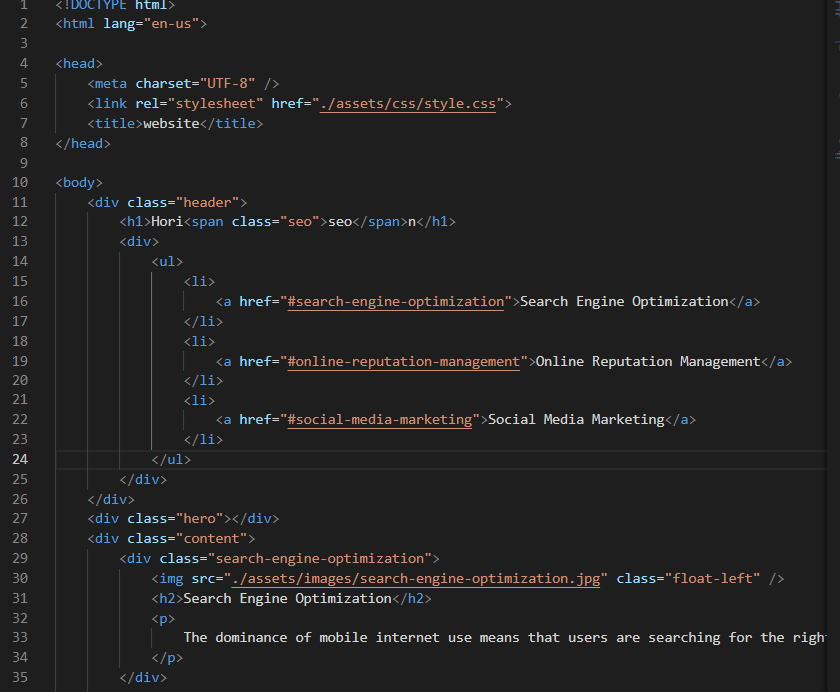

# Semantic Markup #

## This is the first homework assignment for my coding bootcamp. ##

The task of this assignment was to refactor a website to improve its accessibility.  The initial version of the html for the site largely did not use semantic html tags to structure the site.  Most of the elements in the site were classified as \
's.  A screenshot of the original code is below:

A summary of changes that I made to the code are as follows:

* A title was added to the \<head> element
* \
 with class "header" was changed to a \<header>
* \
 with the links to the other sections on the page was changed to a \<nav>
    * This resulted in an update being required in the style.css file.  This \
 was referenced in three locations to format the navigation bar.  Each instance of "div" in the css was changed to "nav" (i.e. ".header div ul" was changed to ".header nav ul")
* \
 with class "hero" was changed to a \<figure> with class "backgroundImage"
    * This resulted in an update being required in the style.css file.  The class "hero" is used to set the background image size and provide a source for the image.  The class needed to be updated to match the change in the html.
* \
 with class "content" was changed to a \<section>
* each of the three \
's under the "content" section were changed to \<article>'s
* The Search Engine Optimization article was missing an id that was required for the nav menu link to function.  id "search-engine-optimization" was added to the element
* \
 with class "benefits" was changed to an \<aside>
* Each of the three \
's under the "benefits" aside were changed to \<article>'s
* \
 with class "footer" was changed to a \<footer>
* the \<h2> element in the footer was changed to an \<h4>
    * This resulted in a required change to the css file.  A style was defined for the \<h2> element inside of the footer class.  This was updated to reference the updated \<h4> element.
* an alt property was added to all \ elements
* Consolidated CSS for classes that followed the same styling. Updated classes in html to match consolidated CSS. 
    * Classes "benefit-brand", "benefit-cost", and "benefit-lead" consolidated to "benefit-articles".  Updated CSS to remove duplicated styles and reference updated class name.
    * Classes "search-engine-optimization", "online-reputation-management", and "social-media-marketing" consolidated to "contents-articles".  Updated CSS to remove duplicated sytles, and reference the updated class name.
* Removed unnecessary classes from the html and CSS.
    * The html \
 that was renamed to \<header> no longer needs to have a class named header to define the styling (can just use the element type instead).  The CSS was updated to match this change.
    * The html \
 that was renamed to \<footer> no longer needs to have a class named footer to define the styling (can just use the element type instead).  The CSS was updated to match this change.
* comments were added to both the html and the css files to provide brief descriptions of what each section of code is doing.

The deployed version of the website with my refactored code is live on github pages at the following link:  
https://aavillanueva6.github.io/01-Homework/

